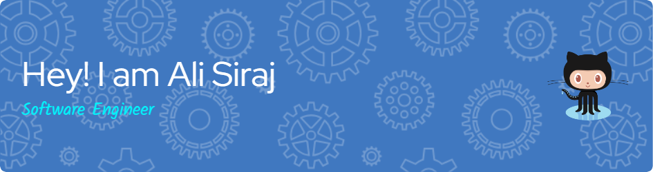

# 💫 About Me:
👯 I’m looking to collaborate on **Flutter, PHP, and embedded systems projects**   🤝 I’m looking for help with **AI integration in web and mobile applications**   🌱 I’m currently learning **Flutter, Python, and backend development with PHP & CodeIgniter**   💬 Ask me about **C++, Flutter, Arduino, and web development**   ⚡ Fun fact: **I love working with both software and hardware, bringing digital and physical worlds together!** 

## 🌐 Socials:
     

# 💻 Tech Stack:
                      
# 📊 GitHub Stats:
 
 

## 🏆 GitHub Trophies

### ✍️ Random Dev Quote

### 🔝 Top Contributed Repo

---

<!-- Proudly created with GPRM ( https://gprm.itsvg.in ) -->
